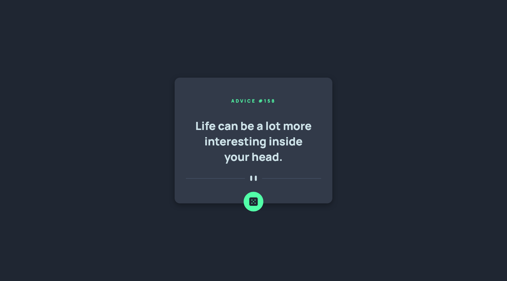
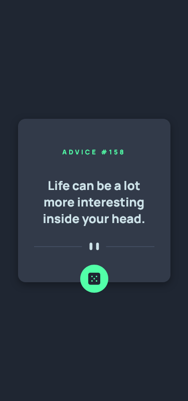

# Advice generator app 🍀

This is a solution to the [Advice generator app challenge on Frontend Mentor](https://www.frontendmentor.io/challenges/advice-generator-app-QdUG-13db). 

## Overview

### The challenge

Users should be able to:

- View the optimal layout for the app depending on their device's screen size
- See hover states for all interactive elements on the page
- Generate a new piece of advice by clicking the dice icon

### Screenshot

<!-- 
 -->

### Links

- Solution URL: [here!](https://musing-lerious-5b8bc6.netlify.app/)

## My process

### Built with

- Mobile-first workflow
- [React](https://reactjs.org/) - JS library
- [Styled Components](https://styled-components.com/) - For styles

### What I learned

This is my second project/challenge working with React, and the first time working with an API to fetch data and using it on an application.

### Continued development

Again, a lot to work on and improve. Slow but steady. Learning and getting used to see how these hooks and actually works and trying to create a solid understanding to put them in a good use.

### Useful resources

- [useFetch custom hook](https://dev.to/techcheck/custom-react-hook-usefetch-eid) - This article, written by Andrew on Dev.to, helped me understand the use of a custom hook for fetching data. Pretty simple and on point.

